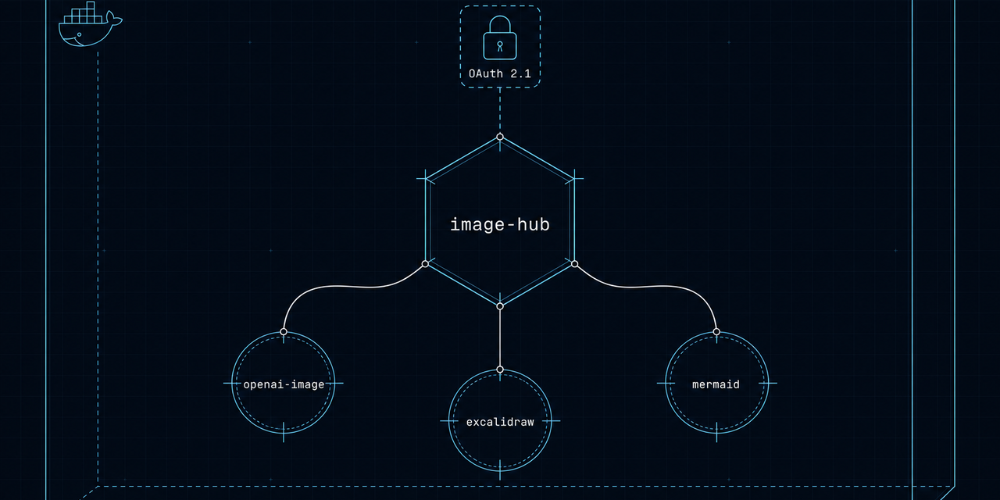
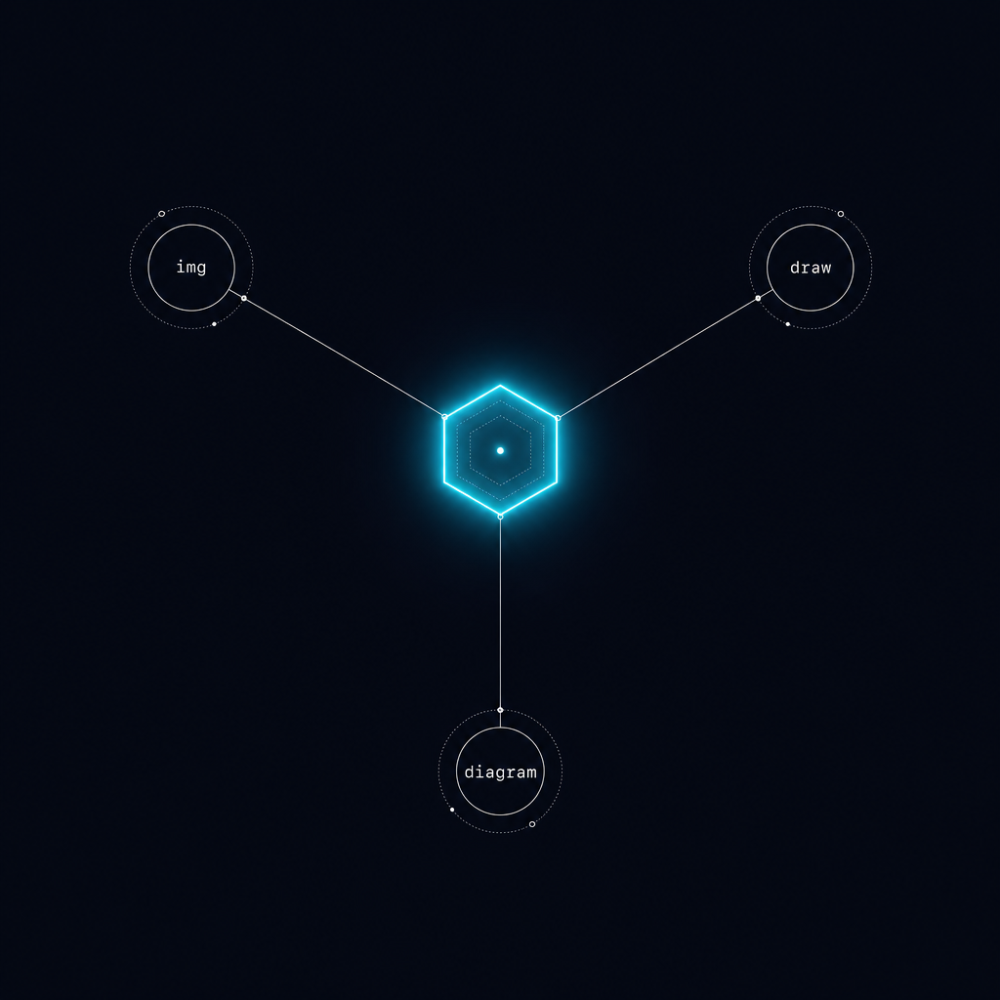
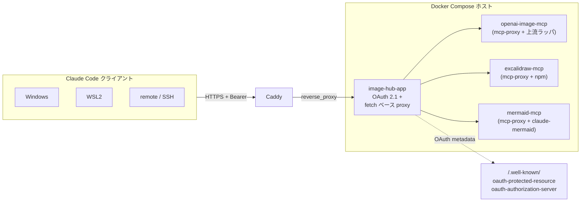

<p align="center">
  
</p>

# image-hub

[](https://github.com/kitepon/image-generator/actions/workflows/ci.yml)
[](https://github.com/kitepon/image-generator/releases)
[](LICENSE)

[English](README.md) · **日本語**

> **1 サブドメイン、画像系 MCP 3 本、OAuth 保護。** `openai-image` / `excalidraw` / `mermaid` の stdio MCP を 1 つの OAuth 2.1 保護 HTTPS エンドポイントに集約し、Windows / WSL2 / リモートの Claude Code から **クライアントに API キーを置かずに** 呼べる。

---

## 30 秒でわかる: 何ができる?

Before:

```jsonc
// 使う全マシンの ~/.claude.json に
"openai-image": {
  "type": "stdio",
  "command": "openai-gen-image-mcp",
  "env": { "OPENAI_API_KEY": "sk-proj-..." }   // <-- マシンごとに鍵が散らばる
},
"excalidraw": { "type": "stdio", "command": "node", "args": ["/path/to/dist/index.js"] },
"mermaid":    { "type": "stdio", "command": "claude-mermaid" }
```

After (このプロジェクト):

```jsonc
// 全マシンの ~/.claude.json に — 鍵なし、URL だけ
"openai-image": { "type": "http", "url": "https://image-hub.example.com/mcp/openai-image" },
"excalidraw":   { "type": "http", "url": "https://image-hub.example.com/mcp/excalidraw" },
"mermaid":      { "type": "http", "url": "https://image-hub.example.com/mcp/mermaid" }
```

サーバー側 (1 ホスト、Docker Compose):

- `image-hub-app` — Express OAuth 2.1 認可サーバー + Bearer 保護のリバースプロキシ
- 3 本の stdio MCP を [`mcp-proxy`](https://www.npmjs.com/package/mcp-proxy) で HTTP 化したコンテナ
- 前段に Caddy (TLS)

結果: 新しいマシンに Claude Code を入れる → URL 3 行貼る → 1 度 OAuth する → 3 つとも動く。上流認証情報はサーバーだけに置く。

## なぜ stdio MCP のままじゃダメなのか

| 観点 | マシンごと stdio | このプロジェクト (HTTP ハブ) |
|---|---|---|
| 上流認証情報の置き場所 | 全マシン | サーバー `.env` のみ |
| 新しいマシンを追加 | stdio パッケージ 3 本再インストール、鍵を貼り直す、Chromium も再配布 | URL 3 行貼って OAuth 1 回 |
| 認証情報ローテ | 全マシン同時に更新 | サーバー `.env` 1 か所差し替え |
| モバイル / SSH / 出先 | 痛い (Chromium も Node もない) | `Claude Code` と URL だけ |
| マシンあたり常駐 stdio プロセス数 | 3 (アイドルでも常駐) | 0 (HTTP、必要時のみ) |

トレードオフ: 常時稼働できる信頼できるホスト (LAN 機 or VPS) が要る。

## アーキテクチャ

<p align="center">
  
</p>



上の OG バナーと放射図は **どちらもこのハブ経由の `openai-image` で生成** している。アーキ図は GitHub が Mermaid ブロックをレンダ — このハブが公開している `mermaid` MCP と同じものを使っている。

## クイックスタート (自分でデプロイする)

> Docker Compose / Caddy / 公開ホスト名がある前提。`image-hub.example.com` は自分のものに置換。

```bash
git clone https://github.com/kitepon/image-generator.git
cd image-generator/server

cp .env.example .env
# 埋める:
#   IMAGEHUB_PUBLIC_MCP_URL=https://image-hub.example.com/mcp
#   IMAGEHUB_PUBLIC_AUTH_URL=https://image-hub.example.com
#   IMAGEHUB_OAUTH_SIGNING_KEY=$(openssl rand -base64 64)
#   IMAGEHUB_ADMIN_PASSCODE=$(openssl rand -base64 18)
#   HERMES_MCP_URL=<openai-image の OAuth 2.1 上流 MCP エンドポイント>

cat caddy/image-hub.snippet >> /path/to/your/Caddyfile
docker compose up -d --build
```

> `openai-image` の上流は OAuth 2.1 認証。初回利用前に一度だけブラウザ consent の bootstrap を走らせ、生成されたトークン state ファイルを配置する — 詳細は [docs/PLAN-mcp-image-hub.md §7](docs/PLAN-mcp-image-hub.md)。

各 Claude Code クライアントで:

```jsonc
// ~/.claude.json
"mcpServers": {
  "openai-image": { "type": "http", "url": "https://image-hub.example.com/mcp/openai-image" },
  "excalidraw":   { "type": "http", "url": "https://image-hub.example.com/mcp/excalidraw" },
  "mermaid":      { "type": "http", "url": "https://image-hub.example.com/mcp/mermaid" }
}
```

Claude Code 再起動 → ブラウザで OAuth (1 つずつ完走させる、詳細は [docs/PHASE2A-client-cutover.md](docs/PHASE2A-client-cutover.md)) → 使う。

## 構築時に踏んだ地雷 (band-aid なし、根本修正)

| # | 地雷 | 採用解 |
|---|---|---|
| 1 | **SSE がリバプロ越しで死ぬ。** `mcp-proxy` 6.x が `event: endpoint` で `/messages?sessionId=...` を絶対パスで返す → クライアントが host root に POST して `/mcp/<name>` を経由せず 404。 | **Streamable HTTP (`/mcp`) に統一**。単一エンドポイントで relative URL 問題が出ない。 |
| 2 | **`http-proxy-middleware` v3 + Express 5 で silent fail。** bearer は通るが upstream に届かず client が 30 秒 timeout、ログにも痕跡なし。 | 40 行の `node:fetch` フォワーダに置換。[`server/image-hub-app/src/index.ts`](server/image-hub-app/src/index.ts) の `app.all(mcpPath, bearer, async ...)` ブロック。 |
| 3 | **Puppeteer/Chromium が root 起動を拒否。** `claude-mermaid` 側に `--no-sandbox` を渡す経路がない。 | Dockerfile で `/usr/bin/chromium` をラッパに差し替え、`--no-sandbox --disable-dev-shm-usage` を強制注入。[`server/mermaid-mcp/Dockerfile`](server/mermaid-mcp/Dockerfile)。 |

OAuth 注意: **同一 MCP サーバー** に対して 2 つのフロー (例: VSCode MCP パネルの click と `authenticate` ツール呼び出し) を同時に走らせない。Claude Code の flow state はサーバー名でキー付けされた単一スロットらしく、後発の起動が前の state を上書きして `complete_authentication` が「No OAuth flow is in progress」で失敗する。入口は片方だけに絞る。

## プロジェクト構成

```
.
├── docs/
│   ├── PLAN-mcp-image-hub.md       # 計画書 (Phase 0 → 4)
│   ├── PHASE0-findings.md          # 事前調査結果
│   └── PHASE2A-client-cutover.md   # クライアント切替手順
└── server/
    ├── image-hub-app/              # Express OAuth + reverse proxy
    ├── openai-image-mcp/           # mcp-proxy + 自前 Python ラッパ (HermesAgent 上流に proxy)
    ├── excalidraw-mcp/             # mcp-proxy + mcp-excalidraw-server
    ├── mermaid-mcp/                # mcp-proxy + claude-mermaid (chromium 修正込み)
    ├── caddy/image-hub.snippet     # リバプロホストブロック
    ├── compose.yml                 # 4 サービス
    └── .env.example                # 雛形
```

## 進捗 / ロードマップ

- **Phase 2.A** (デプロイ + 集約): 完了
- **Phase 3-2** (鍵ローテ): 完了
- **Phase 3-X** (openai-image 上流を HermesAgent に切替、2026-05-18): 完了 — [docs/PLAN-mcp-image-hub.md §7](docs/PLAN-mcp-image-hub.md) 参照
- **Week-2 ガード** (クライアント別レート制限、予算アラート): 進行中
- **Phase 2.B** (`/gallery`、`/dashboard`、content-hash キャッシュ): 計画
- **Phase 4** (パイプライン MCP、画像→プロンプト vision MCP、fal.ai 層): 計画

詳細は [docs/PLAN-mcp-image-hub.md §2](docs/PLAN-mcp-image-hub.md)。

## 謝辞

- [`mcp-proxy`](https://github.com/punkpeye/mcp-proxy) — stdio→HTTP の核
- [`@modelcontextprotocol/sdk`](https://github.com/modelcontextprotocol) — OAuth 2.1 サーバープリミティブ
- [`claude-mermaid`](https://github.com/veelenga/claude-mermaid) / [`mcp-excalidraw-server`](https://github.com/yctimlin/mcp_excalidraw) — 集約対象の上流 stdio MCP

## License

MIT
