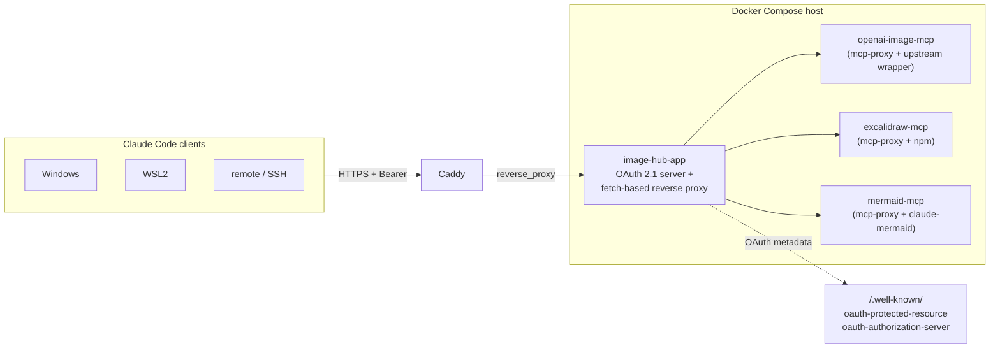

<p align="center">
  
</p>

# image-hub

[](https://github.com/kitepon-rgb/image-generator/actions/workflows/ci.yml)
[](https://github.com/kitepon-rgb/image-generator/releases)
[](LICENSE)

**English** · [日本語](README.ja.md)

> **One subdomain, three image MCPs, OAuth-gated.** Aggregate `openai-image`, `excalidraw`, and `mermaid` stdio MCP servers behind a single OAuth 2.1-protected HTTPS endpoint, callable from Windows / WSL2 / remote Claude Code clients with **no API key on the client side**.

---

## 30 seconds: what does this do?

Before:

```jsonc
// ~/.claude.json on every machine you use
"openai-image": {
  "type": "stdio",
  "command": "openai-gen-image-mcp",
  "env": { "OPENAI_API_KEY": "sk-proj-..." }   // <-- key on every laptop
},
"excalidraw": { "type": "stdio", "command": "node", "args": ["/path/to/dist/index.js"] },
"mermaid":    { "type": "stdio", "command": "claude-mermaid" }
```

After (this project):

```jsonc
// ~/.claude.json on every machine — no keys, just URLs
"openai-image": { "type": "http", "url": "https://image-hub.example.com/mcp/openai-image" },
"excalidraw":   { "type": "http", "url": "https://image-hub.example.com/mcp/excalidraw" },
"mermaid":      { "type": "http", "url": "https://image-hub.example.com/mcp/mermaid" }
```

Server-side (one host, Docker Compose):

- `image-hub-app` — Express OAuth 2.1 authorization server + Bearer-protected reverse proxy
- 3 stdio MCP servers wrapped via [`mcp-proxy`](https://www.npmjs.com/package/mcp-proxy) into HTTP containers
- Caddy out front for TLS

Result: install Claude Code on a new laptop → paste 3 URLs → run OAuth flow once → all three image/diagram MCPs work. Upstream credentials live only on the server.

## Why not just use stdio MCPs everywhere?

| Concern | Per-machine stdio | This project (HTTP hub) |
|---|---|---|
| Upstream credential location | Every laptop | One server `.env` only |
| Onboard a new machine | Reinstall 3 stdio packages, re-paste keys, re-distribute Chromium | Paste 3 URLs, run OAuth once |
| Credential rotation | Update every laptop simultaneously | Change `.env` on the server |
| Mobile / SSH / remote | Painful (no Chromium, no Node) | Just `Claude Code` + the URLs |
| Total stdio processes spawned per machine | 3 (always running, even idle) | 0 (HTTP, on-demand) |

Tradeoff: you need a host you trust to keep always-on (LAN box or a VPS).

## Architecture

<p align="center">
  
</p>



The OG banner above and the radial diagram were both **generated by `openai-image` running through this very hub**. The architecture diagram is rendered by GitHub from the Mermaid block — using the same `mermaid` MCP that this hub exposes.

## Quick start (your own deployment)

> Assumes Docker Compose, Caddy, and a public hostname. Replace `image-hub.example.com` with yours.

```bash
git clone https://github.com/kitepon-rgb/image-generator.git
cd image-generator/server

cp .env.example .env
# fill in:
#   IMAGEHUB_PUBLIC_MCP_URL=https://image-hub.example.com/mcp
#   IMAGEHUB_PUBLIC_AUTH_URL=https://image-hub.example.com
#   IMAGEHUB_OAUTH_SIGNING_KEY=$(openssl rand -base64 64)
#   IMAGEHUB_ADMIN_PASSCODE=$(openssl rand -base64 18)
#   HERMES_MCP_URL=<your OAuth 2.1 upstream MCP endpoint for openai-image>

cat caddy/image-hub.snippet >> /path/to/your/Caddyfile
docker compose up -d --build
```

> `openai-image`'s upstream authenticates over OAuth 2.1. Before first use, run its one-time browser-consent bootstrap and place the resulting token-state file — see [docs/PLAN-mcp-image-hub.md §7](docs/PLAN-mcp-image-hub.md).

Then on each Claude Code client:

```jsonc
// ~/.claude.json
"mcpServers": {
  "openai-image": { "type": "http", "url": "https://image-hub.example.com/mcp/openai-image" },
  "excalidraw":   { "type": "http", "url": "https://image-hub.example.com/mcp/excalidraw" },
  "mermaid":      { "type": "http", "url": "https://image-hub.example.com/mcp/mermaid" }
}
```

Restart Claude Code, complete the browser OAuth flow (one MCP at a time — see [docs/PHASE2A-client-cutover.md](docs/PHASE2A-client-cutover.md)), and call away.

## Lessons learned (root cause fixes, not band-aids)

While building this, three non-obvious traps surfaced. The fixes are baked into the code; they're documented here so you don't waste an evening rediscovering them.

| # | Trap | Fix |
|---|---|---|
| 1 | **SSE transport dies behind a reverse proxy.** `mcp-proxy` 6.x emits `event: endpoint` with `/messages?sessionId=...` as an absolute path, which the client resolves against the host root — bypassing the `/mcp/<name>` mount and 404'ing. | Use **Streamable HTTP** (`/mcp`) end-to-end. Single endpoint, no relative-URL resolution. |
| 2 | **`http-proxy-middleware` v3 + Express 5 silently fail.** Bearer middleware passes, but the request never reaches upstream and the client times out at 30 s — no error logged anywhere. | Replace with a 40-line `node:fetch` forwarder. See [`server/image-hub-app/src/index.ts`](server/image-hub-app/src/index.ts) — the `app.all(mcpPath, bearer, async ...)` block. |
| 3 | **Puppeteer/Chromium refuses to run as root in containers.** `claude-mermaid` provides no flag to inject `--no-sandbox`. | In the Dockerfile, swap `/usr/bin/chromium` for a wrapper that always passes `--no-sandbox --disable-dev-shm-usage`. See [`server/mermaid-mcp/Dockerfile`](server/mermaid-mcp/Dockerfile). |

Plus an OAuth gotcha: don't fire two OAuth flows for the **same** MCP server simultaneously (e.g. clicking the VSCode MCP panel *and* calling the `authenticate` tool). The flow state is keyed per server and gets overwritten — the second `complete_authentication` then fails with "No OAuth flow is in progress". Use one entry path at a time.

## Project structure

```
.
├── docs/
│   ├── PLAN-mcp-image-hub.md       # Full plan (Phase 0 → 4)
│   ├── PHASE0-findings.md          # Pre-implementation investigation
│   └── PHASE2A-client-cutover.md   # Client setup guide
└── server/
    ├── image-hub-app/              # Express OAuth + reverse proxy
    ├── openai-image-mcp/           # mcp-proxy + thin Python wrapper (proxies to HermesAgent upstream)
    ├── excalidraw-mcp/             # mcp-proxy + mcp-excalidraw-server
    ├── mermaid-mcp/                # mcp-proxy + claude-mermaid (with chromium fix)
    ├── caddy/image-hub.snippet     # Reverse proxy host block
    ├── compose.yml                 # 4 services
    └── .env.example                # Secret template
```

## Status & roadmap

- **Phase 2.A** (deploy + aggregate): complete
- **Phase 3-2** (key rotation): complete
- **Phase 3-X** (openai-image upstream cutover to HermesAgent, 2026-05-18): complete — see [docs/PLAN-mcp-image-hub.md §7](docs/PLAN-mcp-image-hub.md)
- **Week-2 guards** (per-client rate limit, budget alerts): in progress
- **Phase 2.B** (`/gallery`, `/dashboard`, content-hash cache): planned
- **Phase 4** (pipeline MCP, image→prompt vision MCP, fal.ai layer): planned

See [docs/PLAN-mcp-image-hub.md §2](docs/PLAN-mcp-image-hub.md) for the full checklist.

<details>
<summary>Why this repo exists (origin story)</summary>

The author was running 3 image-related stdio MCPs on Windows — `openai-image`, `excalidraw`, `mermaid` — and wanted them available from WSL2, SSH sessions, mobile, and friends' machines without copying upstream credentials (and the Chromium dependency for mermaid) to every device.

A few searches turned up no off-the-shelf "MCP gateway with OAuth + reverse proxy + per-server transport translation" project, so this is one. The OAuth implementation pattern is borrowed from a sibling Relay-MCP project; the rest is fresh.

</details>

## Acknowledgments

- [`mcp-proxy`](https://github.com/punkpeye/mcp-proxy) — the stdio→HTTP wrapping that makes any of this possible
- [`@modelcontextprotocol/sdk`](https://github.com/modelcontextprotocol) — OAuth 2.1 server primitives
- [`claude-mermaid`](https://github.com/veelenga/claude-mermaid), [`mcp-excalidraw-server`](https://github.com/yctimlin/mcp_excalidraw) — the upstream stdio MCPs being aggregated

## License

MIT
